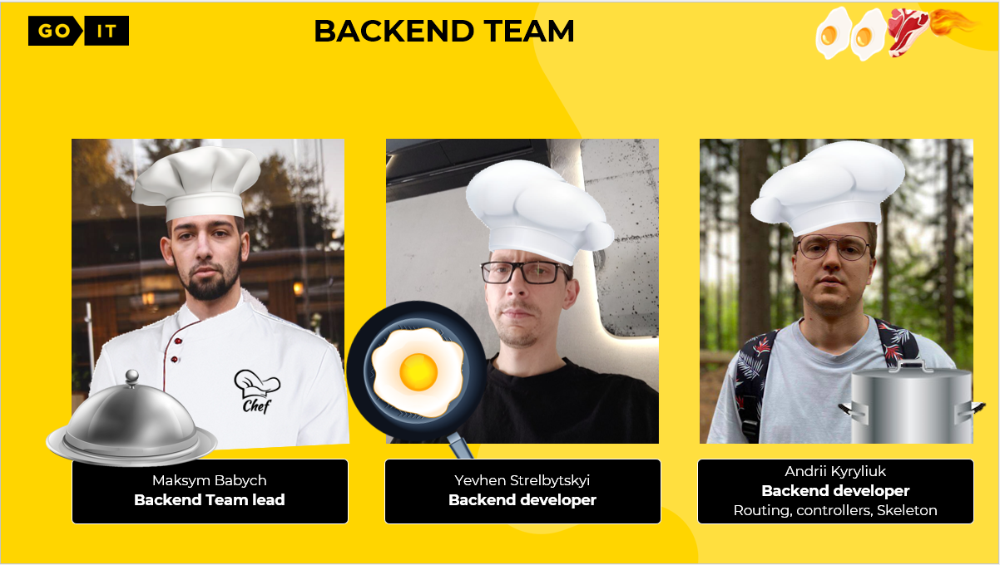
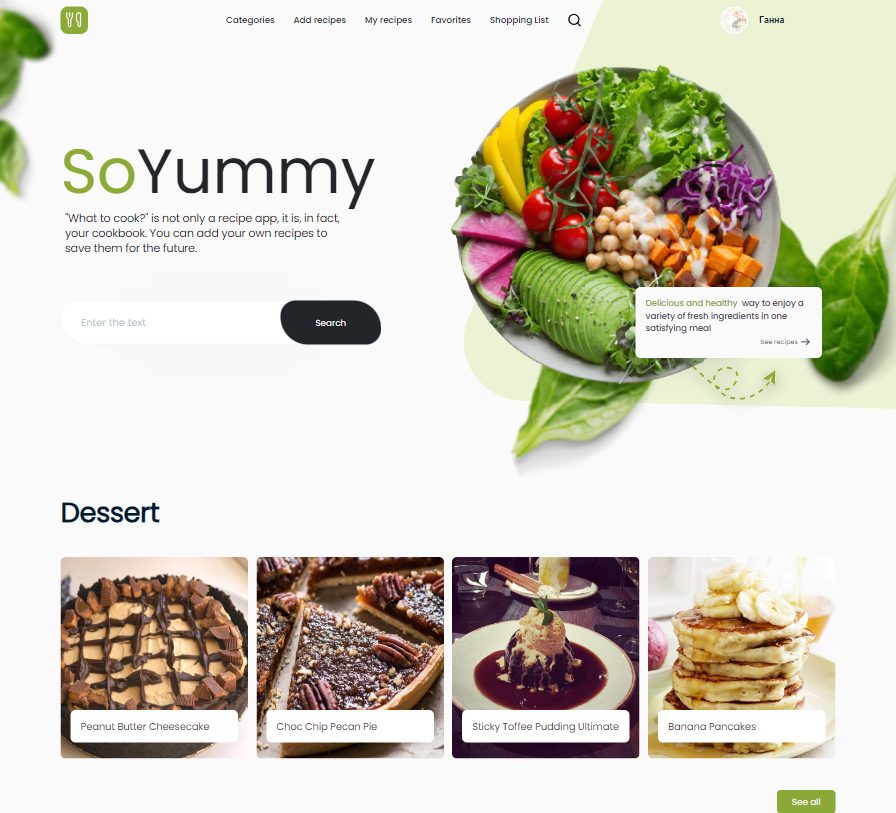

# SoYummy - Your Ultimate Web Cookbook

      

SoYummy is a feature-rich web cookbook application. It allows you to easily
discover, create, and share a wide variety of recipes, and make shopping lists
for your cooking adventures. You can also create an account, log in, change your
username, and update your profile picture. Enjoy cooking like never before with
SoYummy!

This project is available at
https://anette1983.github.io/project-team_developer_007_react

## Backend info

This application uses it's own backend created by our team with Node.js and
MongoDB. The server manages collections of recipes and users, providing
authentication/authorization, email verification, and the ability to work with
images.

- Backend is available at https://so-yummy-project-hnb2.onrender.com
- [Repository link](https://github.com/anette1983/project-team_developer_007_node)
- Documentation:
  [Swagger](https://so-yummy-project-hnb2.onrender.com/api-docs/#/)

## Features

### Authorization

- **User registration**: Easily create a new account by providing your email
  address and password. A **verification email** is sent to validate the user's
  account, ensuring account security.

- **User login**: Existing users can log in using their registered email address
  and password.

### Recipe Exploration

- **Сategories**: Explore recipes by category, ensuring a wide range of options
  for every taste.

- **Recipe sharing**: Share your culinary creations by providing recipe details,
  including name, ingredients, preparation steps, and images.

- **Recipe discovery**: Discover a diverse array of recipes shared by fellow
  users. Search recipes by name, category, or ingredients to find the perfect
  dish.

- **My recipes**: Keep track of your personally crafted recipes in one
  convenient location.

- **Favorite recipes**: Curate your list of favorite recipes for quick and easy
  access to your go-to dishes.

### Shopping Made Simple

- **Ingredient ordering**: Add recipe ingredients to your **shopping list** for
  hassle-free grocery shopping.

### Newsletter subscribe

- **Subscribe** for our newsletters

### Personalization

- **Username and avatar management**: Customize your profile by changing your
  username and updating your avatar image to reflect your personality.

### User-Friendly Design

- **Adaptive design**: Enjoy a seamless experience across different devices with
  adaptive design breakpoints at 375px, 768px, and 1440px.

## Available Routes

- `/register` - redirects to RegisterPage
- `/signin` - redirects to SigninPage
- `/main` - renders MainPage component
- `/categories/:categoryName` - redirects to CategoriesPage
- `/add` - redirects to AddRecipesPage
- `/my` - redirects to MyRecipesPage
- `/favorite` - redirects to FavoritePage
- `/shopping-list` - redirects to ShoppingListPage
- `/search` - redirects to SearchPage

## Used Technologies

The SoYummy web application is built using the following technologies:

- Frontend:
  

    

      
      
      
      
      
      
      
      
      
      
    

  

    <!-- - HTML5
    - CSS3
    - JavaScript
    - React.js
    - Redux Toolkit
    - React Router -->

- Backend:

	
	
	
    
	
   
   
   
   
   

- Additional tools and libraries:
  - Animate.css
  - bcrypt
  - Multer
  - Joi
  - clsx

## Usage

To use this project locally, please follow these steps:

1. Clone the repository to your local machine using the following command: git
   clone https://github.com/anette1983/project-team_developer_007_react.git

2. Navigate to the project's directory: cd project-team_developer_007_react

3. Install the project dependencies using npm: npm install

4. Customize the project's configuration according to your requirements. You may
   need to modify configuration files and environment variables.

5. Start the project: npm start

6. Access the application by navigating to `http://localhost:3000` in your web
   browser.

## Our team

 

## Screenshots

 

 

 

 

 

